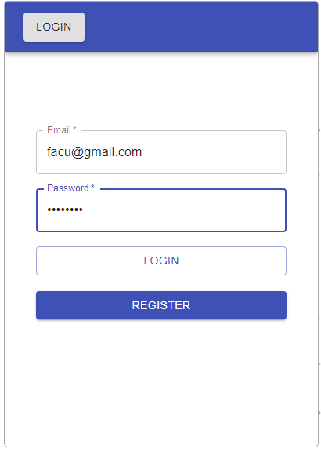
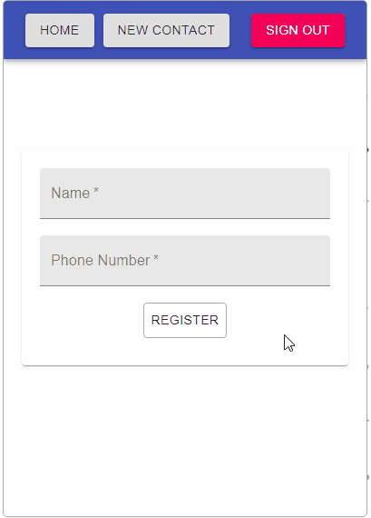
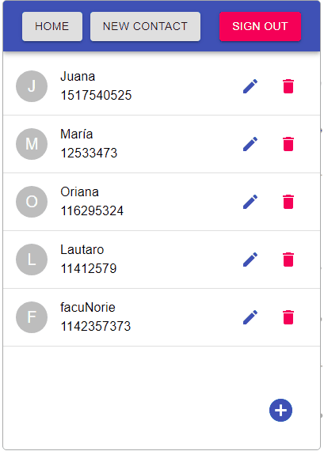

# Agenda de contactos

Aplicación web que simula ser la típica herramienta que almacena y gestiona nuestros contactos.

Link a la demo: https://fb-firestore-9a351.web.app/

## Login

Contamos con registro e inicio de sesión. Para así poder tener una cuenta única y segura (todas las rutas se encuentran protegidas) con nuestros respectivos contactos.

Una vez logeados podemos acceder a dos secciones:

## Creación de contacto

Aquí tenemos la sección para crear un contacto nuevo.

## Lista de contactos

Una vez tengamos uno o varios contactos, los podremos ver todos aquí en esta sección, que renderiza una lista con cada uno de los contactos. Todo contacto tiene 2 opciones, editar y eliminar.

